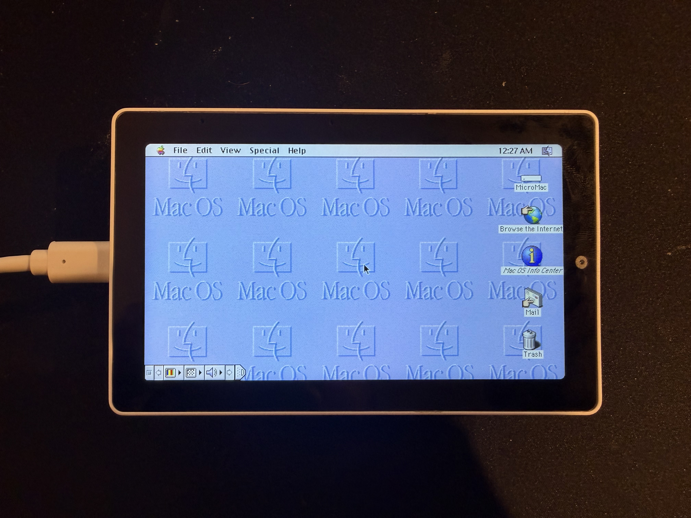
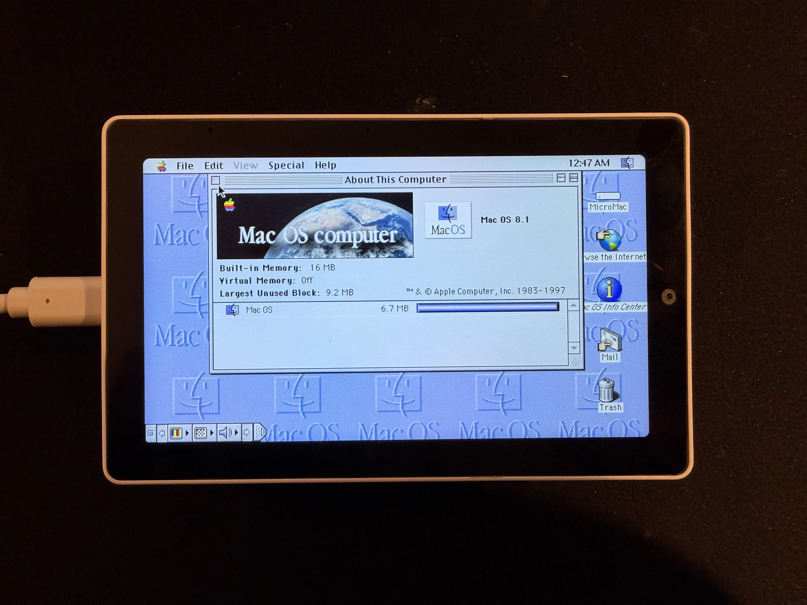
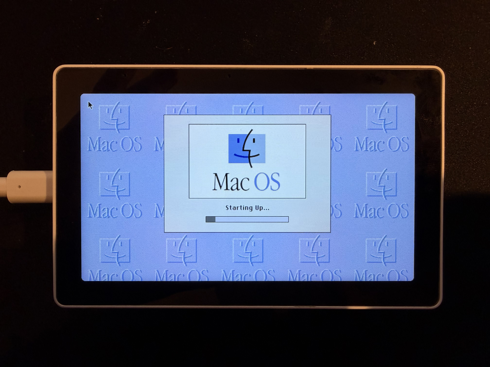
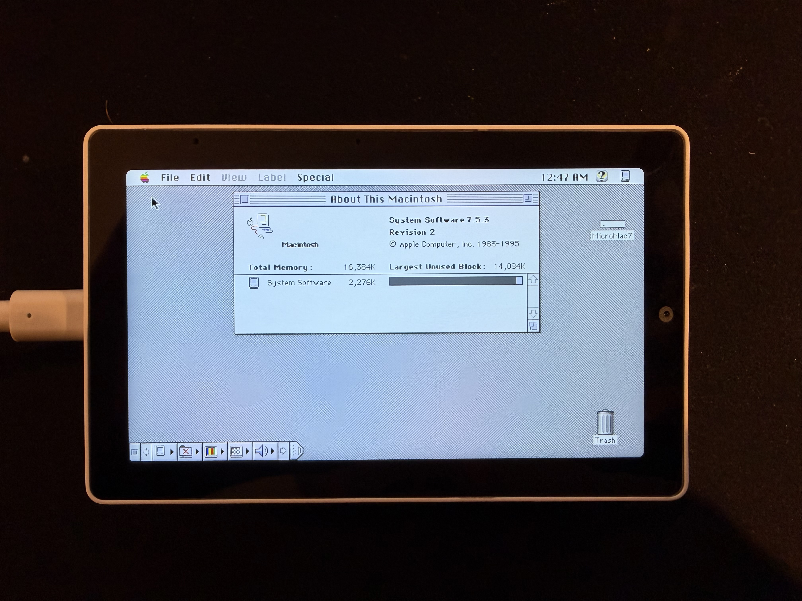
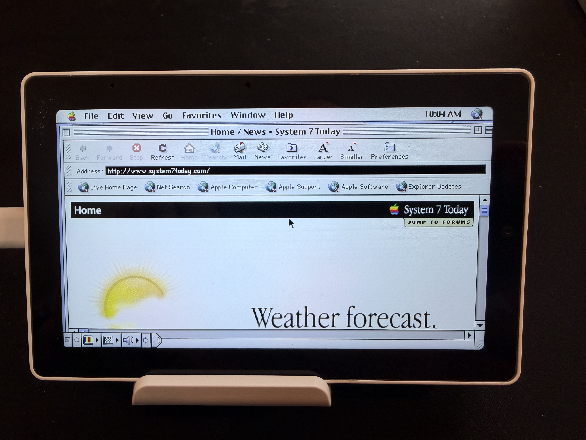

# BasiliskII ESP32 — Classic Macintosh Emulator for M5Stack Tab5

A full port of the **BasiliskII** Macintosh 68k emulator to the ESP32-P4 microcontroller, running on the M5Stack Tab5 hardware. This project brings classic Mac OS (System 7.x through Mac OS 8.1) to a portable embedded device with touchscreen input and USB peripheral support.


---

## Screenshots

<p align="center">
  
</p>

*Flying Toasters running smoothly with write-time dirty tracking and tile-based rendering*

<p align="center">
  
  
</p>

<p align="center">
  
  
</p>

<p align="center">
  
</p>

*Browsing the web on System 7 via the built-in WiFi networking*

<p align="center">
  <a href="screenshots.md">
    
  </a>
</p>

---

## Overview

This project runs a **Motorola 68040** emulator that can boot real Macintosh ROMs and run genuine classic Mac OS software. Performance is comparable to a **Macintosh Quadra 610** (25 MHz 68040), achieving **24 FPS video** and **2-3 MIPS** CPU speed. The emulation includes:

- **CPU**: Motorola 68040 emulation with FPU (68881) — 2-3 MIPS
- **RAM**: Configurable from 4MB to 16MB (allocated from ESP32-P4's 32MB PSRAM)
- **Display**: 640×360 virtual display (2× scaled to 1280×720 physical display), supporting 1/2/4/8-bit color depths at 24 FPS
- **Storage**: Hard disk and CD-ROM images loaded from SD card
- **Input**: Capacitive touchscreen (as mouse) + USB keyboard/mouse support
- **Audio**: Classic Mac sound output via ES8388 codec (toggleable in boot GUI)
- **Networking**: WiFi internet access via NAT router (TCP, UDP, ICMP, DHCP)
- **Video**: Optimized pipeline with write-time dirty tracking, double-buffered DMA, and tile-based rendering

## Hardware

### [M5Stack Tab5](https://shop.m5stack.com/products/m5stack-tab5-iot-development-kit-esp32-p4)

The Tab5 features a unique **dual-chip architecture** that makes it ideal for this project:

| Chip | Role | Key Features |
|------|------|--------------|
| **ESP32-P4** | Main Application Processor | 400MHz dual-core RISC-V, 32MB PSRAM, MIPI-DSI display |
| **ESP32-C6** | Wireless Co-processor | WiFi 6, Bluetooth LE 5.0 — provides internet access to classic Mac OS |

### Key Specifications

| Component | Details |
|-----------|---------|
| **Display** | 5" IPS TFT, 1280×720 (720p), MIPI-DSI interface |
| **Touch** | Capacitive multi-touch (ST7123 controller) |
| **Memory** | 32MB PSRAM for emulated Mac RAM + frame buffers |
| **Storage** | microSD card slot for ROM, disk images, and settings |
| **USB** | Type-A host port for keyboard/mouse, Type-C for programming |
| **Audio** | ES8388 DAC/ADC codec — classic Mac sound output |
| **Battery** | NP-F550 Li-ion (2000mAh) for portable operation |

See [boardConfig.md](boardConfig.md) for detailed pin mappings and hardware documentation.

---

## Architecture

### Dual-Core Design

The emulator leverages the ESP32-P4's dual-core RISC-V architecture for optimal performance:

```
┌─────────────────────────────────────────────────────────────────┐
│                        ESP32-P4 (400MHz)                        │
├────────────────────────────┬────────────────────────────────────┤
│         CORE 0             │              CORE 1                │
│    (Video & I/O Core)      │       (CPU Emulation Core)         │
├────────────────────────────┼────────────────────────────────────┤
│  • Video rendering task    │  • 68040 CPU interpreter           │
│  • Double-buffered DMA     │  • Fast-path memory access         │
│  • 2×2 pixel scaling       │  • Write-time dirty marking        │
│  • Input task (60Hz)       │  • Batch instruction execution     │
│  • USB HID processing      │  • ROM patching                    │
│  • Audio output (ES8388)   │  • Disk I/O                        │
│  • Network RX polling      │                                    │
│  • Event-driven @ 24 FPS   │                                    │
└────────────────────────────┴────────────────────────────────────┘
```

### Memory Layout

```
┌──────────────────────────────────────────────────────────────┐
│                    32MB PSRAM Allocation                     │
├──────────────────────────────────────────────────────────────┤
│  Mac RAM (4-16MB)          │  Configurable via Boot GUI      │
├────────────────────────────┼─────────────────────────────────┤
│  Mac ROM (~1MB)            │  Q650.ROM or compatible         │
├────────────────────────────┼─────────────────────────────────┤
│  Mac Frame Buffer (230KB)  │  640×360 @ 8-bit indexed color  │
├────────────────────────────┼─────────────────────────────────┤
│  Display Buffer (1.8MB)    │  1280×720 @ RGB565              │
├────────────────────────────┼─────────────────────────────────┤
│  Free PSRAM                │  Varies based on RAM selection  │
└──────────────────────────────────────────────────────────────┘

┌──────────────────────────────────────────────────────────────┐
│                    Internal SRAM (Priority)                  │
├──────────────────────────────────────────────────────────────┤
│  CPU Function Table        │  cpufunctbl - hot path lookup   │
├────────────────────────────┼─────────────────────────────────┤
│  Memory Bank Pointers      │  256KB - memory banking         │
├────────────────────────────┼─────────────────────────────────┤
│  Palette (512 bytes)       │  256 RGB565 entries             │
├────────────────────────────┼─────────────────────────────────┤
│  Dirty Tile Bitmap         │  144 bits (write-time tracking) │
├────────────────────────────┼─────────────────────────────────┤
│  Tile Render Lock Bitmap   │  144 bits (race prevention)     │
├────────────────────────────┼─────────────────────────────────┤
│  Double-Buffered Tile Bufs │  ~28KB (DMA pipelining)         │
└──────────────────────────────────────────────────────────────┘
```

### Video Pipeline

The video system uses a highly optimized pipeline with **write-time dirty tracking** to minimize CPU overhead:

```
┌─────────────────────────────────────────────────────────────────┐
│                    Video Pipeline Architecture                   │
├─────────────────────────────────────────────────────────────────┤
│                                                                  │
│  ┌──────────────┐    marks dirty    ┌─────────────────────────┐ │
│  │  68040 CPU   │ ─────────────────▶│   Dirty Tile Bitmap     │ │
│  │  (Core 1)    │                   │   (16×9 = 144 tiles)    │ │
│  └──────────────┘                   └─────────────────────────┘ │
│         │                                      │                │
│         │ writes                               │ read & clear   │
│         ▼                                      ▼                │
│  ┌──────────────┐                   ┌─────────────────────────┐ │
│  │ Mac Frame    │                   │    Video Task (Core 0)  │ │
│  │   Buffer     │ ─────────────────▶│  • Tile snapshot        │ │
│  │ (640×360)    │   read tiles      │  • Palette lookup       │ │
│  └──────────────┘                   │  • 2×2 scaling          │ │
│                                     └─────────────────────────┘ │
│                                                │                │
│                                                │ push tiles     │
│                                                ▼                │
│                                     ┌─────────────────────────┐ │
│                                     │   MIPI-DSI Display      │ │
│                                     │      (1280×720)         │ │
│                                     └─────────────────────────┘ │
└─────────────────────────────────────────────────────────────────┘
```

#### Key Features

1. **Write-Time Dirty Tracking**: When the 68040 CPU writes to the framebuffer, the memory system immediately marks the affected tile(s) as dirty. This eliminates expensive per-frame comparisons.

2. **Tile-Based Rendering**: The screen is divided into a 16×9 grid of 40×40 pixel tiles (144 total). Only dirty tiles are re-rendered each frame, typically reducing video CPU time by 60-90%.

3. **Double-Buffered DMA**: Render to one buffer while DMA pushes another to the display. Both tile rendering and full-frame streaming use this pipelining for maximum throughput.

4. **Per-Tile Render Locks**: Atomic locks prevent race conditions during tile snapshot. If the CPU writes to a tile being rendered, it's automatically re-queued for the next frame—ensuring glitch-free display.

5. **Multi-Depth Support**: Supports 1/2/4/8-bit indexed color modes with packed pixel decoding. Mac OS can switch between depths via the Monitors control panel.

6. **Event-Driven Refresh at 24 FPS**: Cinema-standard frame rate with task notifications—the video task sleeps until signaled, reducing idle polling overhead.

---

## Emulation Details

### BasiliskII Components

This port includes the following BasiliskII subsystems, adapted for ESP32:

| Component | File(s) | Description |
|-----------|---------|-------------|
| **UAE CPU** | `uae_cpu/*.cpp` | Motorola 68040 interpreter |
| **Memory** | `uae_cpu/memory.cpp` | Memory banking with write-time dirty tracking |
| **ADB** | `adb.cpp` | Apple Desktop Bus for keyboard/mouse |
| **Video** | `video_esp32.cpp` | Tile-based display driver with 2× scaling |
| **Disk** | `disk.cpp`, `sys_esp32.cpp` | HDD image support via SD card |
| **CD-ROM** | `cdrom.cpp` | ISO image mounting |
| **XPRAM** | `xpram_esp32.cpp` | Non-volatile parameter RAM |
| **Timer** | `timer_esp32.cpp` | 60Hz/1Hz tick generation |
| **ROM Patches** | `rom_patches.cpp` | Compatibility patches for ROMs |
| **Audio** | `audio_esp32.cpp` | Sound output via ES8388 codec |
| **Networking** | `ether_esp32.cpp`, `net_router.cpp` | WiFi NAT router (TCP/UDP/ICMP/DHCP) |
| **Input** | `input_esp32.cpp` | Touch + USB HID handling |

### Supported ROMs

The emulator works best with **Macintosh Quadra** series ROMs:

| ROM File | Machine | Recommended |
|----------|---------|-------------|
| `Q650.ROM` | Quadra 650 | ✅ Best compatibility |
| `Q700.ROM` | Quadra 700 | ✅ Good |
| `Q800.ROM` | Quadra 800 | ✅ Good |
| `68030-IIci.ROM` | Mac IIci | ⚠️ May work |

### Supported Operating Systems

| OS Version | Status | Notes |
|------------|--------|-------|
| System 7.1 | ✅ Works | Lightweight, fast boot |
| System 7.5.x | ✅ Works | Good compatibility |
| Mac OS 8.0 | ✅ Works | Full-featured |
| Mac OS 8.1 | ✅ Works | Latest supported |

---

## Getting Started

### Prerequisites

- **Hardware**: M5Stack Tab5
- **Software**: [PlatformIO](https://platformio.org/) (CLI or IDE extension)
- **SD Card**: FAT32 formatted microSD card (8GB+ recommended)

### SD Card Setup

#### Quick Start (Recommended)

Download a ready-to-use SD card image with Mac OS pre-installed:

**[📥 Download sdCard.zip](https://www.mcchord.net/static/sdCard.zip)**

1. Format your microSD card as **FAT32**
2. Extract the ZIP contents to the **root** of the SD card
3. Insert into Tab5 and boot

#### Manual Setup

Alternatively, create your own setup with these files in the SD card root:

```
/
├── Q650.ROM              # Macintosh Quadra ROM (required)
├── Macintosh.dsk         # Hard disk image (required)
├── System753.iso         # Mac OS installer CD (optional)
└── DiskTools1.img        # Boot floppy for installation (optional)
```

To create a blank disk image:

```bash
# Create a 500MB blank disk image
dd if=/dev/zero of=Macintosh.dsk bs=1M count=500
```

Then format it during Mac OS installation.

### Flashing the Firmware

#### Option 1: Pre-built Firmware (Easiest)

Download the latest release from GitHub:

**[📥 Download Latest Release](https://github.com/amcchord/M5Tab-Macintosh/releases/latest)**

Flash the single merged binary using `esptool.py`:

```bash
# Install esptool if you don't have it
pip install esptool

# Flash the merged binary (connect Tab5 via USB-C)
esptool.py --chip esp32p4 \
    --port /dev/ttyACM0 \
    --baud 921600 \
    write_flash \
    0x0 M5Tab-Macintosh-v3.0.bin
```

**Note**: Replace `/dev/ttyACM0` with your actual port:
- **macOS**: `/dev/cu.usbmodem*` or `/dev/tty.usbmodem*`  
  (Run `ls /dev/cu.*` to find available ports)
- **Windows**: `COM3` (or similar, check Device Manager)
- **Linux**: `/dev/ttyACM0` or `/dev/ttyUSB0`

**Troubleshooting Flash Issues**:
- If flashing fails, try a lower baud rate: `--baud 460800` or `--baud 115200`
- If the device isn't detected, hold the **BOOT** button while pressing **RESET** to enter bootloader mode
- On some systems you may need to run with `sudo` or add your user to the `dialout` group

#### Option 2: Build from Source

```bash
# Clone the repository
git clone https://github.com/amcchord/M5Tab-Macintosh.git
cd M5Tab-Macintosh

# Build the firmware
pio run

# Upload to device (connect via USB-C)
pio run --target upload

# Monitor serial output
pio device monitor
```

#### Creating Release Binaries

When you build with `pio run`, a merged binary is automatically created in the `release/` directory. This binary includes the bootloader, partition table, and application - ready for single-command flashing.

For versioned releases, use the release script:

```bash
# Create a versioned release binary
./scripts/build_release.sh v3.0

# Output: release/M5Tab-Macintosh-v3.0.bin
```

The release binary can be flashed with a single esptool command:

```bash
esptool --chip esp32p4 --port /dev/cu.usbmodem* \
    --baud 921600 write-flash 0x0 release/M5Tab-Macintosh-v3.0.bin
```

---

## Boot GUI

On startup, a **classic Mac-style boot configuration screen** appears:

```
┌─────────────────────────────────────────┐
│           BasiliskII                    │
│        Starting in 3...                 │
│                                         │
│    Disk: Macintosh.dsk                  │
│    RAM: 8 MB                            │
│    WiFi: 192.168.1.100                  │
│                                         │
│  ┌─────────────────────────────────┐    │
│  │       Change Settings           │    │
│  └─────────────────────────────────┘    │
└─────────────────────────────────────────┘
```

### Features

- **3-second countdown** to auto-boot with saved settings
- **Tap to configure** disk images, CD-ROMs, RAM size, and WiFi
- **WiFi auto-connect** - countdown pauses while connecting
- **Settings persistence** saved to `/basilisk_settings.txt` on SD card
- **Touch-friendly** large buttons designed for the 5" touchscreen

### Configuration Options

| Setting | Options | Default |
|---------|---------|---------|
| Hard Disk | Any `.dsk` or `.img` file on SD root | First found |
| CD-ROM | Any `.iso` file on SD root, or None | None |
| RAM Size | 4 MB, 8 MB, 12 MB, 16 MB | 8 MB |
| Audio | Enable/disable sound output | Enabled |
| WiFi | Configure SSID and password | None |

### WiFi Setup

To configure WiFi before booting:

1. Tap **"Change Settings"** during the countdown
2. Tap the **"WiFi"** button at the bottom of the settings screen
3. The device will scan for available networks
4. **Select a network** from the list
5. **Tap the password field** to open the on-screen keyboard
6. Enter your WiFi password and tap **"OK"**
7. Tap **"Connect"** to connect to the network
8. Once connected, tap **"Back"** to return to settings
9. Tap **"Boot"** to start the emulator

**Auto-Connect**: Once WiFi is configured, it will automatically connect on subsequent boots. The countdown screen will display:
- "WiFi: Connecting..." while connecting
- "WiFi: 192.168.x.x" once connected (shows your IP address)
- "WiFi: Connection failed" if the connection fails

The countdown will **pause while WiFi is connecting** (up to 10 seconds), ensuring the connection completes before booting into Mac OS.

### Networking Support

The emulator includes TCP/IP networking via the ESP32-C6 WiFi co-processor. This provides NAT-based internet access for classic Mac applications with built-in DHCP server support.

**Virtual Network Configuration:**
- MacOS IP: `10.0.2.15` (assigned via DHCP)
- Gateway: `10.0.2.2`
- DNS: `10.0.2.3` (forwarded to real DNS)

**Supported Protocols:**
- DHCP (automatic IP configuration)
- TCP (web browsing, FTP, etc.)
- UDP (DNS, NTP, etc.)
- ICMP (ping)

**WiFi Setup:**
1. During the boot countdown, tap **"Change Settings"**
2. Tap the **"WiFi"** button to open the WiFi configuration screen
3. Select your network and enter the password using the on-screen keyboard
4. Tap **"Connect"** - once connected, your IP will be displayed
5. The connection is saved and will auto-connect on future boots

**Mac OS Network Setup:**
1. In MacOS 8.x, open **TCP/IP Control Panel** and set:
   - Connect via: **Ethernet**
   - Configure: **Using DHCP Server**
   
   That's it! DHCP will automatically configure all network settings.

**Manual Configuration (if needed):**
- IP Address: `10.0.2.15`
- Subnet Mask: `255.255.255.0`
- Router/Gateway: `10.0.2.2`
- Name Server: `10.0.2.3`

**Compatible Applications:**
- MacTCP-based applications (Fetch, NCSA Telnet, etc.)
- Open Transport applications (Netscape Navigator, Internet Explorer)
- Ping utilities

---

## Input Support

### Touch Screen

The capacitive touchscreen acts as a single-button mouse:

- **Tap** = Click
- **Drag** = Click and drag
- Coordinates are scaled from 1280×720 display to 640×360 Mac screen

### USB Keyboard

Connect a USB keyboard to the **USB Type-A port**. Supported features:

- Full QWERTY layout with proper Mac key mapping
- Modifier keys: Command (⌘), Option (⌥), Control, Shift
- Function keys F1-F15
- Arrow keys and navigation cluster
- Numeric keypad
- **Caps Lock LED** sync with Mac OS

### USB Mouse

Connect a USB mouse for relative movement input:

- Left, right, and middle button support
- Relative movement mode (vs. absolute for touch)

---

## Project Structure

```
M5Tab-Macintosh/
├── src/
│   ├── main.cpp                    # Application entry point
│   └── basilisk/                   # BasiliskII emulator core
│       ├── main_esp32.cpp          # Emulator initialization & main loop
│       ├── video_esp32.cpp         # Tile-based display driver with dirty tracking
│       ├── input_esp32.cpp         # Touch + USB HID input handling
│       ├── boot_gui.cpp            # Pre-boot configuration GUI
│       ├── sys_esp32.cpp           # SD card disk I/O
│       ├── timer_esp32.cpp         # 60Hz/1Hz interrupt generation
│       ├── audio_esp32.cpp          # Sound output via ES8388 codec
│       ├── ether_esp32.cpp         # Network driver for WiFi NAT
│       ├── net_router.cpp          # TCP/UDP/ICMP NAT router
│       ├── xpram_esp32.cpp         # NVRAM persistence to SD
│       ├── prefs_esp32.cpp         # Preferences loading
│       ├── uae_cpu/                # Motorola 68040 CPU emulator
│       │   ├── newcpu.cpp          # Main CPU interpreter loop
│       │   ├── memory.cpp          # Memory banking with write-time dirty tracking
│       │   ├── fpu/                # FPU emulation (IEEE)
│       │   └── generated/          # CPU instruction tables
│       └── include/                # Header files
├── platformio.ini                  # PlatformIO build configuration
├── partitions.csv                  # ESP32 flash partition table
├── boardConfig.md                  # Hardware documentation
├── screenshots/                    # Demo images and videos
└── scripts/                        # Build helper scripts
```

---

## Performance

The emulator achieves **smooth desktop performance**, comparable to a real **Macintosh Quadra 610** (25 MHz 68040). Extensive optimization work on CPU scheduling, video rendering, disk I/O, and memory placement delivers a responsive experience across Mac OS 7 and 8.

### Benchmarks

| Metric | Value |
|--------|-------|
| **CPU Speed** | 2 - 3 MIPS (depending on workload) |
| **Video Refresh** | 24 FPS (cinema-standard smooth) |
| **Boot Time** | ~15 seconds to Mac OS desktop |
| **Comparison** | Similar to Macintosh Quadra 610 (25 MHz 68040) |
| Typical Dirty Tiles | 5-15 tiles/frame (vs. 144 total) |
| Video CPU Savings | 60-90% reduction with dirty tracking |

### Optimization Techniques

1. **Write-Time Dirty Tracking**: Marks tiles dirty at CPU write time, avoiding expensive per-frame comparisons. Dirty bitmap uses atomic operations for thread safety.

2. **Dual-Core Separation**: CPU emulation (Core 1) runs independently from video/input (Core 0) with minimal synchronization.

3. **Fast-Path Memory Access**: Inline checks for RAM/ROM bypass expensive memory bank lookup for the majority of memory operations.

4. **Batch Instruction Execution**: CPU executes 32 instructions per loop iteration before checking ticks, reducing per-instruction overhead.

5. **Double-Buffered DMA**: Video rendering uses double-buffered tiles and row buffers—render to one buffer while DMA pushes the other to display.

6. **Per-Tile Render Locks**: Atomic locks prevent race conditions during tile snapshot, ensuring glitch-free rendering even with concurrent CPU writes.

7. **Input Task on Core 0**: USB host processing (~2.3ms) runs in a dedicated task, offloading work from the CPU emulation loop.

8. **Memory Bank Placement**: The 256KB memory bank pointer array and CPU function table are allocated in internal SRAM for faster access.

9. **Adaptive CPU/IO Scheduling**: CPU emulation, disk I/O, video rendering, and network polling are carefully balanced across both cores with adaptive timing to maximize throughput without starving any subsystem.

10. **PSRAM Allocation for Network Buffers**: Packet buffers and temporary allocations use PSRAM to keep internal SRAM free for the SDIO WiFi driver's DMA buffers, preventing crashes under heavy network load.

11. **Aggressive Compiler Optimizations**: Build uses `-O3`, `-funroll-loops`, `-ffast-math`, and aggressive inlining for hot paths.

---

## Build Configuration

Key build flags in `platformio.ini`:

```ini
build_flags =
    -O3                          # Maximum optimization
    -funroll-loops               # Unroll loops for speed
    -ffast-math                  # Fast floating point
    -finline-functions           # Aggressive inlining
    -DEMULATED_68K=1             # Use 68k interpreter
    -DREAL_ADDRESSING=0          # Use memory banking
    -DSAVE_MEMORY_BANKS=1        # Dynamic bank allocation
    -DROM_IS_WRITE_PROTECTED=1   # Protect ROM from writes
    -DFPU_IEEE=1                 # IEEE FPU emulation
```

---

## Troubleshooting

### Common Issues

| Problem | Solution |
|---------|----------|
| "SD card initialization failed" | Ensure SD card is FAT32, properly seated |
| "Q650.ROM not found" | Place ROM file in SD card root directory |
| Black screen after boot | Check serial output for errors; verify ROM compatibility |
| Touch not responding | Wait for boot GUI to complete initialization |
| USB keyboard not working | Connect to Type-A port (not Type-C) |
| Slow/choppy display | Check serial for `[VIDEO PERF]` stats; typical is 60-90% partial updates |
| No audio output | Ensure audio is enabled in the boot GUI settings screen |
| Screen flickering/tearing | May occur during heavy graphics; dirty tracking minimizes this |

### Serial Debug Output

Connect via USB-C and use:

```bash
pio device monitor
```

Look for initialization messages:

```
========================================
  BasiliskII ESP32 - Macintosh Emulator
  M5Stack Tab5 Edition
========================================

[MAIN] Display: 1280x720
[MAIN] Free heap: 473732 bytes
[MAIN] Free PSRAM: 31676812 bytes
[MAIN] Total PSRAM: 33554432 bytes
[MAIN] CPU Freq: 360 MHz
[VIDEO] Display size: 1280x720
[VIDEO] Mac frame buffer allocated: 0x48100000 (230400 bytes)
[VIDEO] Dirty tracking: 16x9 tiles (144 total)
[VIDEO] Video task created on Core 0 (write-time dirty tracking)
[AUDIO] Audio initialized (ES8388 codec)
```

During operation, performance stats are reported every 5 seconds:

```
[IPS] 2847523 instructions/sec (2.85 MIPS), total: 142376150
[VIDEO PERF] frames=75 (full=2 partial=68 skip=5)
```

---

## Acknowledgments

- **BasiliskII** by Christian Bauer and contributors — the original open-source 68k Mac emulator
- **UAE** (Unix Amiga Emulator) — the CPU emulation core
- **[M5Stack](https://shop.m5stack.com/products/m5stack-tab5-iot-development-kit-esp32-p4)** — for the excellent Tab5 hardware and M5Unified/M5GFX libraries
- **EspUsbHost** — USB HID support for ESP32
- **Claude** (Anthropic) — AI pair programmer that made this port possible

---

## License

This project is based on BasiliskII, which is licensed under the **GNU General Public License v2**.

---


*This project was built with the assistance of [Claude](https://anthropic.com). I am in no way smart enough to have done this on my own.* 🤖🍎

*Run classic Mac OS in your pocket.*
