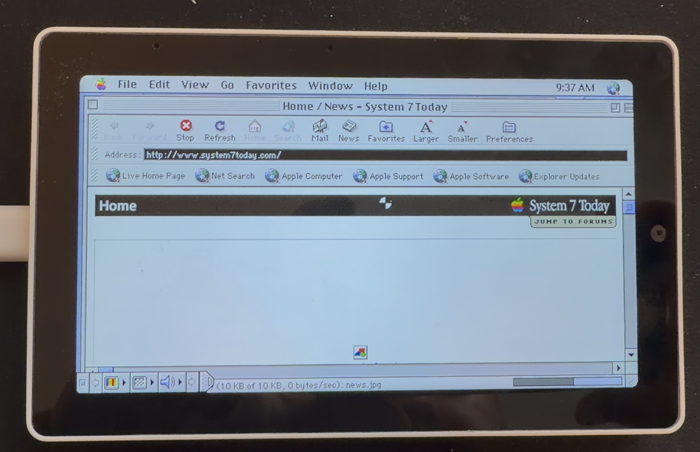

# Screenshots & Animations

## Flying Toasters v2.5 (Performance Update)

  

Flying Toasters running smoothly after the v2.5 performance optimizations — write-time dirty tracking, packed pixel support, and optimized memory placement.

---

## System 7.5.3 Booting

  

Watch the full boot sequence from ROM initialization through to the Mac OS 7.5.3 desktop.

---

## Flying Toasters (Original)

  

The classic After Dark Flying Toasters screensaver running on real Mac OS via the emulator.

---

## Performance Statistics

  

Serial output showing the v2.5 performance monitoring — CPU cycles, video frame times, cache statistics, and more.

---

## Static Screenshots

  
  

  
  

---

## Networking Demo

  

Browsing the web on System 7 using the built-in WiFi networking via the ESP32-C6 co-processor.

### Loading a Webpage Video

Watch the emulator load a real webpage over WiFi:

  <video src="screenshots/LoadingAWebpage.mp4" width="80%" controls>
    Your browser does not support the video tag.
  </video>

  

---

## Video

For even higher quality footage, check out the boot video:

  

